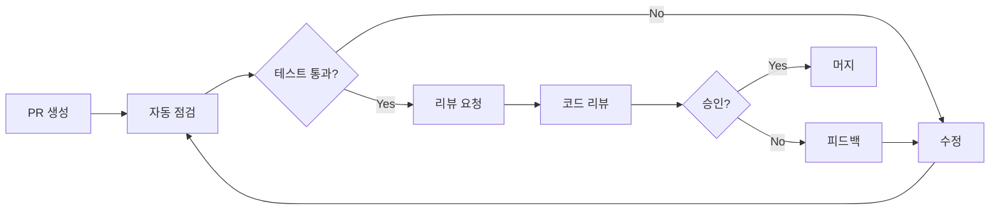

# 코드 리뷰 가이드라인

> 참고: 커밋 메시지 규칙은 리포지토리 루트의 `CLAUDE.md`에 정리되어 있습니다. 자세한 내용은 `../../CLAUDE.md#commit-message`를 참조하세요.

이 문서는 {{PROJECT_NAME}} 프로젝트의 코드 리뷰 프로세스와 베스트 프랙티스를 정의합니다.

## 목차

1. [리뷰 프로세스](#리뷰-프로세스)
2. [PR 템플릿](#pr-템플릿)
3. [리뷰 체크리스트](#리뷰-체크리스트)
4. [코딩 규칙](#코딩-규칙)
5. [리뷰 베스트 프랙티스](#리뷰-베스트-프랙티스)
6. [자동화 도구](#자동화-도구)

## 리뷰 프로세스

### 리뷰 워크플로우



### 브랜치 전략

```bash
# 워크트리 생성 (R-CM-008: commit-guard가 git checkout -b / switch -c / branch 생성을 차단)
make wt.new BR=feature/lesson-improvement
cd .worktrees/feature/lesson-improvement

# main 변경 반영은 fetch + ff-only merge (R-CM-008: rebase는 destructive-git-guard가 차단)
git fetch origin
git merge --ff-only origin/main

# PR 생성 전 로컬에서 테스트/린트 (Makefile SSOT — q.lint 타깃은 없음, q.analyze 사용)
make q.test
make q.analyze

# 커밋 정리는 reset --soft HEAD~N + 새 commit (R-CM-008: rebase 차단)
# 또는 /create-pr 가 squash merge 로 자동 처리
```

## PR 템플릿

### `.github/pull_request_template.md`

```markdown
## 개요

<!-- 이 PR에서 무엇을 구현/수정했는지 간략히 기술 -->

## 목적

<!-- 왜 이 변경이 필요한지 -->

## 스크린샷

<!-- UI 변경이 있는 경우 변경 전후 스크린샷 -->

| Before      | After      |
| ----------- | ---------- |
|  |  |

## 변경 내용

<!-- 주요 변경 사항을 목록으로 정리 -->

- [ ] 기능A 구현
- [ ] 버그B 수정
- [ ] 성능C 개선

## 테스트

<!-- 수행한 테스트와 결과 -->

- [ ] 단위 테스트 추가/업데이트
- [ ] 통합 테스트 수행
- [ ] 수동 테스트 수행

### 테스트 커버리지

- 변경 전: XX%
- 변경 후: XX%

## 관련 문서

<!-- 업데이트가 필요한 문서 -->

- [ ] README.md
- [ ] CLAUDE.md
- [ ] 도메인 로직 문서
- [ ] API 명세서

## 셀프 체크리스트

<!-- PR 생성 전 자기 확인 -->

- [ ] 코드가 [코딩 규칙](#코딩-규칙)을 준수한다
- [ ] 적절한 한국어 주석을 추가했다
- [ ] `make q.analyze`에서 오류가 없다
- [ ] `make q.test`가 전부 통과한다
- [ ] 불필요한 디버그 코드를 삭제했다
- [ ] 성능에 미치는 영향을 고려했다
- [ ] 보안 리스크가 없다
- [ ] 접근성을 고려했다

## 관련 Issue

<!-- 관련 Issue 번호 -->

Closes #123

## 리뷰어 주의사항

<!-- 리뷰 시 특별히 봐주길 바라는 부분 -->

## 레이블

<!-- 적절한 레이블 선택 -->

- `feature`: 새 기능
- `bugfix`: 버그 수정
- `refactor`: 리팩토링
- `performance`: 성능 개선
- `documentation`: 문서 업데이트
- `test`: 테스트 추가/수정
```

## 리뷰 체크리스트

### 1. 기능성

```tsx
/// ✅ 좋은 예: 명확한 책임과 적절한 에러 핸들링
export class LessonService {
  /// 레슨을 가져온다
  static async fetchLesson(lessonId: string): Promise<Lesson | null> {
    try {
      // 입력 검증
      if (!lessonId) {
        throw new Error('레슨 ID가 비어 있습니다');
      }

      // API에서 가져오기
      const response = await api.getLesson(lessonId);
      return response;
    } catch (e) {
      console.error("레슨 가져오기 에러:", e);
      return null;
    }
  }
}

/// ❌ 나쁜 예: 에러 핸들링 없음, 책임 불명확
export const badService = {
  async fetchData(id: any) {
    var data = await api.get(id);
    return data;
  }
};
```

### 2. 가독성

```tsx
/// ✅ 좋은 예: 명확한 명명과 구조
export const calculateProgress = ({
  completedLessons,
  totalLessons,
}: {
  completedLessons: number;
  totalLessons: number;
}): number => {
  if (totalLessons === 0) return 0.0;

  const progress = completedLessons / totalLessons;
  return Math.min(Math.max(progress, 0.0), 1.0);
};

/// ❌ 나쁜 예: 불명확한 명명, 매직 넘버
export const calc = (a: number, b: number) => {
  if (b === 0) return 0;
  return a / b > 1 ? 1 : a / b;
};
```

### 3. 성능

```tsx
/// ✅ 좋은 예: Promise.all에 의한 병렬 처리
export const processLargeDataset = async (items: RawItem[]) => {
  // 병렬 처리로 효율화
  const results = await Promise.all(items.map(item => processItem(item)));
  return results;
};

/// ❌ 나쁜 예: 비효율적인 루프
export const inefficientProcessor = async (items: RawItem[]) => {
  const results = [];
  for (const item of items) {
    // 직렬 처리 (불필요하게 느림)
    results.push(await processItem(item));
  }
  return results;
};
```

### 4. 보안

```tsx
/// ✅ 좋은 예: 적절한 입력 검증(Zod)과 새니타이즈
import { z } from "zod";

const ProfileUpdateSchema = z.object({
  name: z.string().min(1).max(50).optional(),
  bio: z.string().max(200).optional(),
});

export const updateProfile = async (userId: string, updates: unknown) => {
  // 입력 검증
  const parsed = ProfileUpdateSchema.safeParse(updates);
  if (!parsed.success) {
    throw new Error('유효하지 않은 입력 데이터입니다');
  }

  // 권한 체크 (예: RLS나 서버 사이드 검증)
  if (!(await hasPermission(userId, 'profile.update'))) {
    throw new Error('권한이 없습니다');
  }

  // 데이터베이스 업데이트 (ORM 사용)
  return await db.user.update({
    where: { id: userId },
    data: parsed.data,
  });
};
```

### 5. 컴포넌트 구조

```tsx
/// ✅ 좋은 예: 명확한 구조와 분리
export const WellStructuredComponent = ({ title, items }: { title: string, items: Item[] }) => {
  return (
    <div className="flex flex-col min-h-screen">
      <Header title={title} />
      <main className="flex-1 p-4">
        {items.map(item => <ItemCard key={item.id} item={item} />)}
      </main>
      <Footer />
    </div>
  );
};

// 책임별로 컴포넌트를 분리한다
const Header = ({ title }: { title: string }) => (
  <header className="bg-surfaceContainerLight dark:bg-surfaceContainerDark p-4">
    <h1 className="text-xl font-bold">{title}</h1>
  </header>
);
```

## 코딩 규칙

### 네이밍 규칙

```tsx
// 컴포넌트명 / 클래스명: PascalCase
export const UserProfile = () => { ... }

// 변수/함수명/훅명: camelCase
const userName = 'John';
const calculateScore = () => { ... }
const useLessonData = () => { ... }

// 파일명: kebab-case 또는 PascalCase (프로젝트 규약에 따름)
// user-profile.tsx
// lesson-service.ts
```

### import 순서

```tsx
// 1. 프레임워크
// 프레임워크 전용 import
import Link from 'next/link';

// 2. 외부 패키지
import { z } from 'zod';
import { clsx, type ClassValue } from 'clsx';

// 3. 프로젝트 내부 (절대 경로 / Alias)
import { Button } from '@/shared/components/ui/button';
import { useAuth } from '@/features/auth/hooks';

// 4. 타입 정의
import type { UserProfile } from '@/features/user/types';
```

## 리뷰 베스트 프랙티스

### 리뷰어의 마인드셋

```markdown
## 건설적인 피드백 예시

### ✅ 좋은 피드백
```

이 에러 핸들링은 좋습니다!
추가 개선안으로, 사용자에게 재시도 옵션을
제공하는 것을 고려해보시면 어떨까요?

```

### ❌ 피해야 할 피드백
```

이 코드는 잘못되었습니다.
에러 핸들링이 불충분합니다.

```
```

## 자동화 도구

### GitHub Actions 설정

```yaml
# .github/workflows/quality-gate.yml

name: Quality Gate

on:
  pull_request:
    branches: [main]

jobs:
  quality-gate:
    runs-on: ubuntu-latest
    steps:
      - uses: actions/checkout@v4

      - uses: actions/setup-node@v4
        with:
          node-version: '22'
          cache: 'npm'

      - name: Install dependencies
        run: npm ci

      - name: '[Critical] Format Check'
        run: npx prettier --check .

      - name: '[Critical] Lint'
        run: make q.analyze

      - name: '[Critical] Tests'
        run: make q.test

      - name: '[Info] Build Capability'
        run: make q.build
```

---

최종 업데이트: 2026년 2월
